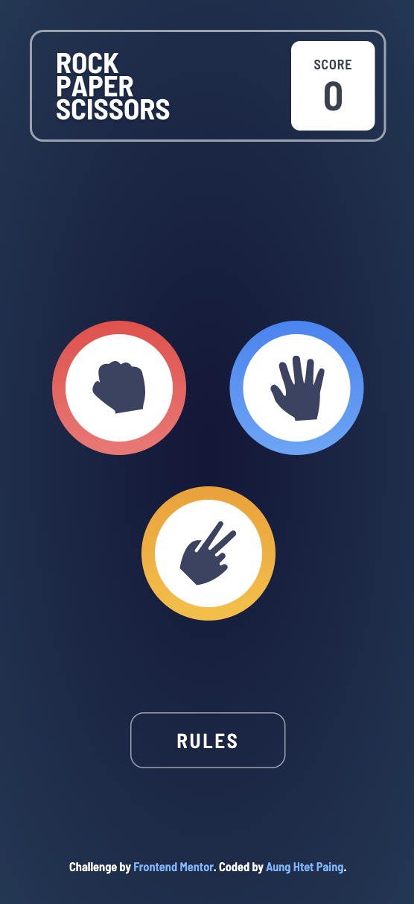
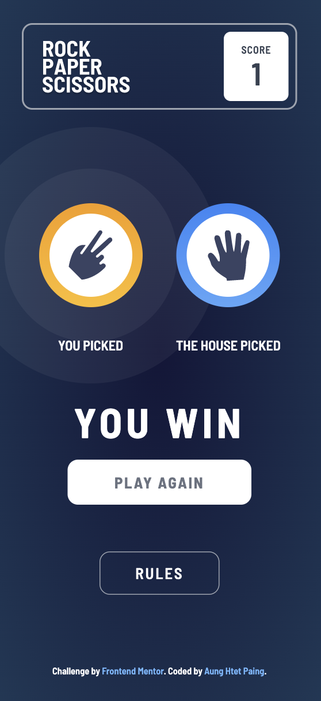
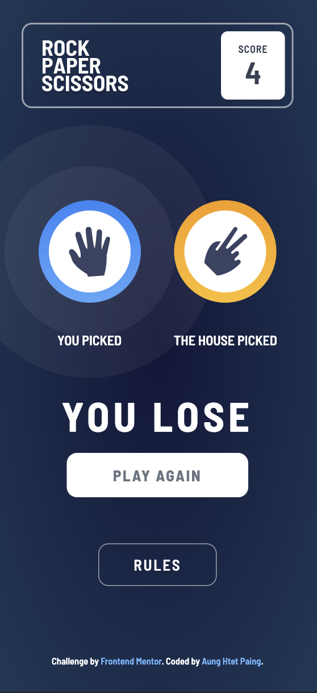

# Frontend Mentor - Rock, Paper, Scissors solution

This is a solution to the [Rock, Paper, Scissors challenge on Frontend Mentor](https://www.frontendmentor.io/challenges/rock-paper-scissors-game-pTgwgvgH). Frontend Mentor challenges help you improve your coding skills by building realistic projects.

## Table of contents

- [Overview](#overview)
  - [The challenge](#the-challenge)
  - [Screenshot](#screenshot)
  - [Links](#links)
- [My process](#my-process)
  - [Built with](#built-with)
  - [Continued development](#continued-development)
  - [Useful resources](#useful-resources)
- [Author](#author)

## Overview

### The challenge

Users should be able to:

- View the optimal layout for the game depending on their device's screen size
- Play Rock, Paper, Scissors against the computer
- Maintain the state of the score after refreshing the browser _(optional)_
- **Bonus**: Play Rock, Paper, Scissors, Lizard, Spock against the computer _(optional)_

### Screenshots

index

win

lose

rules modal

### Links

- Solution URL: [https://www.frontendmentor.io/solutions/rockpaperscissors-game-with-tailwind-and-alpinejs-PyQTGGePn](https://www.frontendmentor.io/solutions/rockpaperscissors-game-with-tailwind-and-alpinejs-PyQTGGePn)

- Live Site URL: [https://ahp-sooyaa.github.io/rock-paper-scissors-game/](https://ahp-sooyaa.github.io/rock-paper-scissors-game/)

**Note: this is only looking good in mobile, not responsive for bigger screen right now.**

## My process

### Built with

- Semantic HTML5 markup
- Flexbox
- CSS Grid
- Mobile-first workflow
- [Alpinejs](https://alpinejs.dev/) - Your new, lightweight, JavaScript framework.
- [TailwindCSS](https://tailwindcss.com/) - Rapidly build modern websites without ever leaving your HTML

### Continued development

Later I will make this responsive for bigger screen.

### Useful resources

- [AlpineJs Documentation](https://alpinejs.dev/start-here)
- [Tailwind Documentation](https://tailwindcss.com/docs)

## Author

- Website - [Aung Htet Paing](https://aunghtetpaing.herokuapp.com/)
- Frontend Mentor - [@ahp-sooyaa](https://www.frontendmentor.io/profile/ahp-sooyaa)
- Twitter - [@aunghte23771311](https://twitter.com/aunghte23771311)
